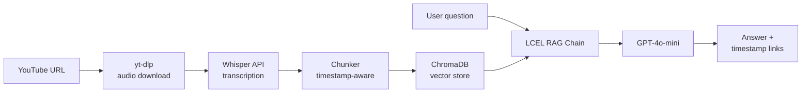

# Tuned

An end-to-end **RAG** pipeline with timestamp-aware retrieval over YouTube transcripts — built with **LangChain**, **OpenAI Whisper**, **ChromaDB**, and **GPT-4o-mini**, deployed on Streamlit with **LangSmith** observability.

Paste any YouTube URL and have a multi-turn conversation with the video. Every answer cites the exact moment it came from as a clickable timestamp link.

---

## How it works



**Ingestion:** yt-dlp reads the audio, Whisper transcribes it with segment-level timestamps, the chunker groups segments into overlapping ~400-word chunks, and each chunk is embedded and stored in ChromaDB with its metadata. The transcript is cached to disk so the same video is never re-processed.

**Retrieval:** when you ask a question, it gets embedded with the same model, ChromaDB finds the 4 most semantically similar chunks, and GPT-4o-mini generates an answer grounded in that context — including clickable timestamp links for every claim.

---

<!-- ## Key engineering decisions

The chunker operates at segment granularity rather than character level. Whisper returns timestamped segments, and timestamps only exist at segment boundaries — splitting mid-segment would require interpolating timestamps, introducing inaccuracy into every citation. The tradeoff is that chunk sizes are approximate (~400 words) rather than exact, which is an acceptable cost for citation reliability.

Whisper's `verbose_json` response format was chosen over the default plain-text response specifically because it returns segment-level `start` and `end` times. Without this, transcription would work but every timestamp would be lost.

Transcripts are cached as JSON files keyed by video ID. On a repeat load, the app returns the cached transcript immediately without touching the Whisper API. This eliminates redundant costs and makes the UI feel instant for previously seen videos. ChromaDB embedding runs a similar deduplication check — if a video ID already exists in the collection, it skips re-embedding entirely.

The RAG chain is built with LangChain's LCEL pattern (`RunnablePassthrough.assign → prompt → LLM → StrOutputParser`) rather than the older `RetrievalQA` abstraction. LCEL is the current standard, gives explicit control over every step in the pipeline, and supports streaming with no additional code changes.

Chat memory is implemented as a plain sliding window dictionary (`session_id → list of (question, answer) tuples`, last 5 exchanges) rather than LangChain's `ConversationBufferWindowMemory`, which was removed in LangChain 1.x. The manual implementation is simpler, has no external dependencies, and behaves identically — it formats the last 5 exchanges as a string and injects them into the prompt as `{chat_history}`.

Each LangChain `Document` carries `video_id`, `video_title`, `start_time` (integer seconds), and `url` as metadata. The `_format_docs` function constructs a pre-built citation link for every chunk before passing context to the LLM. This means the model can copy the link directly into its response rather than trying to construct URLs from partial information — a reliability improvement that matters in practice.

--- -->

## Tech stack

| Component | Technology | Why |
|---|---|---|
| Audio Reading | yt-dlp | Actively maintained, handles most YouTube URL formats |
| Transcription | OpenAI Whisper API (whisper-1) | Runs in the cloud, returns segment-level timestamps |
| Embeddings | text-embedding-3-small | Better benchmarks than ada-002 at lower cost |
| Vector store | ChromaDB | Native LangChain integration |
| RAG pipeline | LangChain LCEL | Intuitive, current standard |
| LLM | GPT-4o-mini (temperature=0) | Best price/performance for factual Q&A |
| UI | Streamlit | Fast to build, easy to deploy, supports chat primitives natively |
| Observability | LangSmith | Logs every chain run for retrieval quality inspection |

---

## Getting started

**Prerequisites:** Python 3.11+, an OpenAI API key, and a LangSmith API key (free tier).

```bash
# 1. Clone the repo
git clone https://github.com/YOUR_USERNAME/tuned.git
cd tuned

# 2. Create and activate a virtual environment
python -m venv venv
source venv/bin/activate  # Windows: venv\Scripts\activate

# 3. Install dependencies
pip install -r requirements.txt

# 4. Create your .env file
touch .env
```

Add the following to `.env`:

```
OPENAI_API_KEY=sk-...
LANGCHAIN_API_KEY=ls-...
LANGCHAIN_TRACING_V2=true
LANGCHAIN_PROJECT=tuned
```

```bash
# 5. Run the app
streamlit run app/main.py
```

The app opens at `http://localhost:8501`.

---

<!-- ## Usage

**Step 1 — Load a video**
Paste any YouTube URL into the sidebar and click "Analyse Video". The sidebar shows live progress through each stage: transcription → chunking → embedding. The first load of a video takes 30–120 seconds depending on length. Every subsequent load is instant (served from cache).

**Step 2 — Chat**
Ask questions in the chat input. Answers are grounded in the transcript and include clickable timestamp links — clicking `[14:32]` opens YouTube at that exact moment. The assistant remembers the last 5 exchanges, so follow-up questions work naturally.

To query across multiple videos, load them one at a time. All loaded videos are queried together on every question.

--- -->

## Project structure

```
tuned/
├── app/
│   └── main.py              # Streamlit UI — page config, sidebar, chat interface
├── utils/
│   ├── transcript_fetcher.py  # Reads audio via yt-dlp, transcribes via Whisper, caches result
│   ├── chunker.py             # Groups Whisper segments into overlapping word-count chunks
│   ├── embedder.py            # Embeds chunks with text-embedding-3-small, stores in ChromaDB
│   └── rag_pipeline.py        # LCEL RAG chain, session memory, timestamp citation formatting
├── cache/                   # Transcript JSON files keyed by video ID (gitignored)
├── chroma_db/               # Persisted ChromaDB vector store (gitignored)
├── data/                    # Temporary audio files deleted after transcription (gitignored)
├── requirements.txt         # Dependencies
└── .env                     # environment variables (gitignored)
```

---

## Cost

All costs are on the OpenAI account. There are no other paid services.

| Operation | Cost | Typical example |
|---|---|---|
| Whisper transcription | ~$0.006 / minute of audio | 30-min video ≈ $0.18 |
| Embeddings (text-embedding-3-small) | ~$0.00002 / 1k tokens | Negligible |
| GPT-4o-mini per question | ~$0.15 / 1M input tokens | ~$0.001 per question |

A 30-minute video costs under $0.20 to process once. After that, the transcript and embeddings are cached, re-loading the same video costs nothing. A typical chat session of 20 questions costs a few cents.

---

## Future improvements

- **Streaming responses** - Stream responses for better user experience instead of waiting for the entire backend process to finish. Swap `.invoke()` for `.stream()` in the RAG chain and use `st.write_stream()` in Streamlit. The pipeline already supports it with no architectural changes.
<!-- - **Reranking** — add a cross-encoder reranker (Cohere or a local model) on top of the ChromaDB results to improve answer relevance on long or multi-topic videos. -->
- **Cloud vector DB** - ChromaDB is local and single-user. Swapping to Qdrant Cloud or Pinecone requires changing ~3 lines in `embedder.py` thanks to LangChain's vectorstore abstraction.
- **Multi-user persistent sessions** - the current in-process memory dict resets on server restart. A Redis-backed session store would make chat history persistent across restarts and support concurrent users.